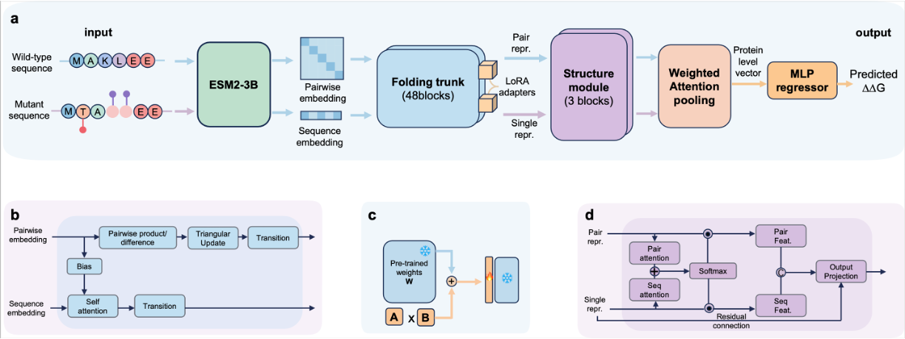

# UniStab: A unified predictor of protein stability changes across all mutation types


[](https://github.com/facebookresearch/hydra)
[](https://arxiv.org/) <!-- TODO: 更新论文链接 -->



## Introduction

UniStab is a unified deep learning framework that predicts protein stability changes across **single-point**, **multi-point**, and **indel** mutations in an end-to-end manner. 

## Installation
```bash
git clone https://github.com/xlab-BioAI/UniStab.git
```

## Requirements
```bash
conda env create -f env.yaml  
conda activate UniStab
```

## Downloading weights
Download the pre-trained model weights from [Google Drive](https://drive.google.com/file/d/1NEe60FXqpmwLi445SJ93d9_Dpqhdy7YA/view?usp=sharing) and place them in the appropriate directory.


## Training
To train the model with default configurations:

```bash
python src/train_lightning.py
```
You can modify training parameters in `config/default.yaml`.

## Inference
```bash
sh infe.sh
```

## Data

## License


## Acknowledgments

We gratefully acknowledge the following projects and their contributions:

- **ThermoMPNN-D**: Transfer learning framework for protein stability prediction ([Dieckhaus et al., 2024](https://www.pnas.org/doi/abs/10.1073/pnas.2314853121))
- **ESMFold**: Evolutionary-scale protein structure prediction ([Lin et al., 2023](https://www.science.org/doi/10.1126/science.ade2574))

Parts of the codebase are adapted from these excellent works.

## Citation
```bibtex
@article{10.1039/d6sc02103d,
    author = {Tan, Hong and Lin, Shenggeng and Xiong, Yi},
    title = {A unified predictor of protein stability changes across all mutation types via implicit structure learning},
    journal = {Chemical Science},
    year = {2026},
    month = {08},
    abstract = { Prediction of protein stability change caused by amino acid substitutions or indels (insertions/deletions) is crucial for protein engineering. While current models excel at single-point substitutions, they struggle with multi-point mutations and indels due to simplistic additivity assumptions and the inability to model backbone conformational changes. To address these limitations, we introduce UniStab, an end-to-end framework for predicting stability changes across all mutation types. By leveraging the implicit geometric reasoning of a pre-trained folding model, UniStab effectively captures non-additive epistatic interactions and local backbone rearrangements without the prohibitive cost of explicit structure generation. Evaluated on a comprehensive benchmark, UniStab demonstrates state-of-the-art performance, particularly in the challenging scenarios of multi-point mutations and indels. Beyond predictive accuracy, UniStab provides interpretable structural insights and effectively guides the design of stabilized variants, facilitating its potential utility in rational protein engineering. },
    issn = {2041-6520},
    doi = {10.1039/d6sc02103d},
    url = {https://doi.org/10.1039/d6sc02103d},
    eprint = {https://pubs.rsc.org/sc/article-pdf/doi/10.1039/d6sc02103d/13623148/d6sc02103d.pdf},
}
```

## Reference
```bibtex
@article{lin2023evolutionary,
  title={Evolutionary-scale prediction of atomic-level protein structure with a language model},
  author={Lin, Zeming and Akin, Halil and Rao, Roshan and Hie, Brian and Zhu, Zhongkai and Lu, Wenting and Smetanin, Nikita and Verkuil, Robert and Kabeli, Ori and Shmueli, Yaniv and others},
  journal={Science},
  volume={379},
  number={6637},
  pages={1123--1130},
  year={2023},
  publisher={American Association for the Advancement of Science}
}

@article{dieckhaus2025protein,
  title={Protein stability models fail to capture epistatic interactions of double point mutations},
  author={Dieckhaus, Henry and Kuhlman, Brian},
  journal={Protein Science},
  volume={34},
  number={1},
  pages={e70003},
  year={2025},
  publisher={Wiley Online Library}
}
```

